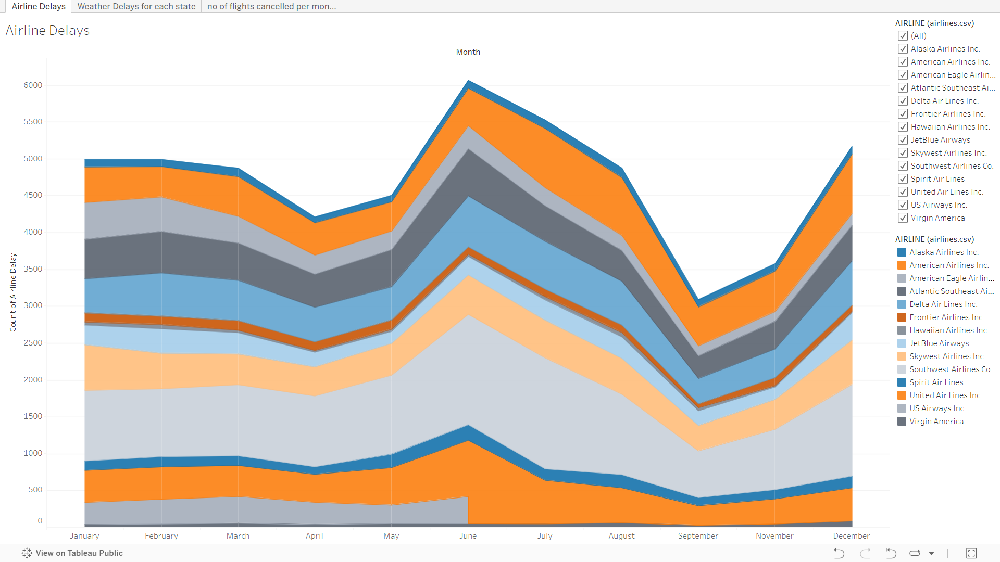

# Flight Delays and Cancellations

The following report discusses some insights about the effectiveness of US domestic flights run by major airlines in 2015. I created data visualizations to reveal insights, tell a story, or highlight patterns within the dataset using Tableau. The following steps outline my approach.

## Visualization A: Which Airlines Have the Worst Airline Delays?

**Links:**
[View the visualization](https://public.tableau.com/shared/4K2PM6ZNC?:display_count=n&:origin=viz_share_link)

**Summary:**
The following insight describes the number of delays for every airline company per month. Southwest Airlines Co. consistently had the most delays each month, with a peak of 1,505 delays in July. In contrast, Hawaiian Airlines Inc. had the least number of delays in July, with only 44 delays.

**Design:**
- Each airline company is represented by a unique color.
- The number of airline delays is plotted over each month from January to December using an area chart.

